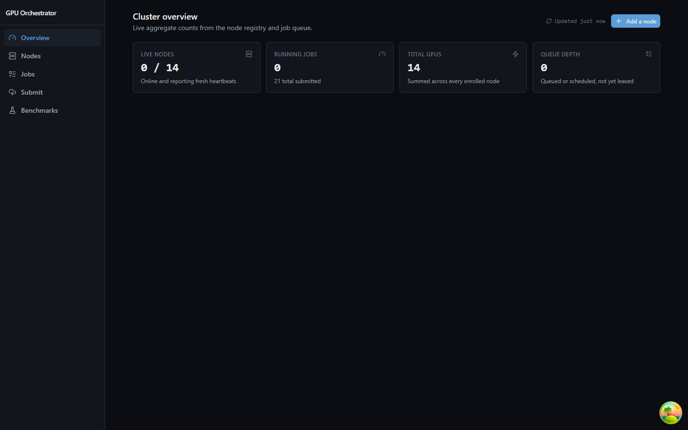

# GPU Orchestrator

**Teach a computer to recognise your own pictures — using spare computers, yours
or your friends', instead of renting an expensive one.**

You give it a set of example photos sorted into categories (say, *cats* and
*dogs*, or *healthy leaf* and *diseased leaf*). It trains an AI model on them,
using whichever computers in your group are free, and gives you back a model
that can tell those categories apart.



---

## Who are you?

| You want to… | Go to | You'll need |
| --- | --- | --- |
| **Train a model** on your own pictures | [Part 1](#part-1--train-a-model) | A web browser and the link someone sent you |
| **Lend your computer** so others can train on it | [Part 2](#part-2--lend-your-computer) | About 10 minutes, once |
| **Run the whole thing** for your group | [Part 3](#part-3--run-it-for-your-group) | About 30 minutes, once — on a free cloud server, or your own Windows PC |

You don't need to know anything about AI or programming for Parts 1 and 2.

---

## Part 1 — Train a model

Nothing to install. Everything happens in your web browser.

### 1. Open the link and make an account

Open the link you were sent. On the sign-in page, click **Create one** (under
*No account?*), choose a username and a password of at least 12 characters, and
click **Create account**. You're signed in straight away.

> **Your work is private.** Only you can see your pictures, your training
> progress and your finished model — not other users, and not the person who
> runs the system.

### 2. Get your pictures ready

Put your pictures in folders, **one folder per category**. The folder's name
*is* the category. Then make a zip file of them.

```
my-pictures.zip
├── cats/
│   ├── photo1.jpg
│   ├── photo2.jpg
│   └── …
└── dogs/
    ├── photo1.jpg
    └── …
```

How to zip on Windows: select the folders, right-click → **Send to** →
**Compressed (zipped) folder**. On a Mac: select them, right-click →
**Compress**.

**Good to know**

- **At least 2 categories.** More pictures per category gives better results —
  aim for a few hundred each if you can.
- **Any common picture type** (JPG, PNG, …) and any size. They're shrunk
  automatically, so big photos are fine.
- **You don't need to sort them perfectly.** Downloaded datasets often come in
  other folder layouts (like `seg_train/…` or `train/` and `test/`); those are
  rearranged for you.
- **Optional:** if you put some pictures aside in a separate `test/` folder
  (with the same category folders inside), those are used to check how good the
  model is. If you don't, a few pictures are set aside for you automatically.

### 3. Upload them

Go to **Datasets**, give your dataset a name, drag your zip onto the box (or
click it to choose the file), and click **Upload dataset**.

- A progress bar shows how it's going. On slow home internet a large dataset can
  take several minutes — **keep the tab open**.
- Short internet hiccups are retried automatically. If the upload fails
  completely, click **Upload dataset** again.
- If something is wrong with the zip, you'll get a plain explanation of what to
  fix.

### 4. Start training

Go to **Train**, pick your dataset, and click **Start training**. The default
settings are sensible — you don't have to change anything. If you're curious:

| Setting | What it means | Suggested |
| --- | --- | --- |
| **Epochs** | How many times the model looks through all your pictures. More can mean better accuracy, but takes longer. | 5–10 |
| **Batch size** | How many pictures it looks at in one go. Bigger is faster on a good graphics card. | 32–256 |
| **Learning rate** | How big a step it takes when it learns. | Leave at 0.01, or 0.001 for your own photos |
| **World size** | How many computers work on *one* job together. Over home internet, more is usually *slower*. | **1** |
| **Scheduler** | How it picks a computer for you. *Adaptive* prefers reliable, nearby, less-busy machines. | adaptive |

### 5. Watch it, then download your model

You're taken to your job's page. You'll see which computer is training it, a
live log, and two charts filling in as it learns:

- **Test accuracy** going up — the share of set-aside pictures it gets right.
- **Training loss** going down — how wrong it still is.

When it finishes, click **Download** on the **Trained model** card. All your
jobs are listed under **Runs**.

If the computer training your job switches off halfway, the job moves to another
computer and **carries on from where it stopped** — you don't lose the work.

---

## Part 2 — Lend your computer

Your computer joins the group and trains other people's jobs while it's
switched on. It only ever connects *out* — no router settings, no special
network setup.

### What you need

- **Windows, Mac or Linux.**
- **Python** — on Windows, installed for you if it's missing. On a Mac or
  Linux, install Python 3.11–3.13 from [python.org](https://www.python.org/downloads/)
  first.
- **Optional:** an NVIDIA graphics card. Without one your computer still helps,
  just more slowly.
- **[Docker Desktop](https://www.docker.com/products/docker-desktop/)** —
  optional on Windows, **required on Mac and Linux**. With it, training runs
  sealed off in a container, which is the safest option.

### 1. Get your join command

Ask the person who runs the system to click **Add a node** on the
**Machines** page. They'll send you one line of text to copy — a different one
for Windows and for Mac/Linux.

### 2. Run it

- **Windows:** press the Start button, type **PowerShell**, open it, paste the
  line (right-click pastes), and press Enter.
- **Mac / Linux:** open **Terminal**, paste the line, press Enter.

It downloads what it needs and connects. On Windows without Docker, it asks
whether to run training as an ordinary program instead and explains what that
means — type `1`, then `yes`, if you're happy with that. On Mac and Linux, start
Docker Desktop first; the command stops and says so if Docker isn't running.

### 3. Leave the window open

While that window is open, your computer is helping. **Closing it stops
sharing.** To share again later, run the same line again — your computer
rejoins as itself, with its track record intact.

**What it can and can't do on your computer**

- It only runs training jobs, and only while the window is open.
- With Docker, each job runs in a locked-down container with no access to your
  files.
- It updates itself automatically when there's a newer version.
- People's training pictures and models pass through your computer while it
  trains their jobs, so only lend it within a group that trusts each other.

---

## Part 3 — Run it for your group

One person runs the central part — the website everyone signs into and the
"brain" that hands jobs to computers. There are two ways:

| | **A free cloud server** (recommended) | **Your own Windows PC** |
| --- | --- | --- |
| Links you share | **Permanent** — never change | Change every time you restart it |
| Your PC must be on | No | Yes, the whole time |
| Friends rejoin after a restart | Automatically | They need a new command |
| Setup | ~30 minutes once (free for students; no card with Azure for Students) | ~30 minutes once |

### Option A — a free cloud server (recommended)

Create a small free cloud server, tick two boxes, and paste one command. You get
permanent links to share, and your own PC joins as one of the computers that
train. Pick a guide:

- **[Azure for Students](docs/DEPLOY-AZURE.md)** — **no credit card**; for
  students (activate it through the GitHub Student Developer Pack).
- **[Oracle Cloud Always Free](docs/DEPLOY-ORACLE.md)** — for anyone with a
  Visa, Mastercard or Amex card for Oracle's identity check.

### Option B — your own Windows PC

#### 1. Install these, once

| Program | What it's for | Get it |
| --- | --- | --- |
| **Docker Desktop** | Runs the brain, its database and its storage | [docker.com](https://www.docker.com/products/docker-desktop/) |
| **Git** | Downloads this project | [git-scm.com](https://git-scm.com/download/win) |
| **Python 3.13** | Lets your own PC lend its graphics card | [python.org](https://www.python.org/downloads/) (tick "Add to PATH") |
| **Node.js (LTS)** | Runs the website | [nodejs.org](https://nodejs.org/) |
| **cloudflared** | Gives friends on other networks a secure link | In PowerShell: `winget install --id Cloudflare.cloudflared` |

Restart your PC after installing, then start **Docker Desktop** once and let it
finish setting up.

#### 2. Download the project

Open **PowerShell** and run:

```powershell
git clone https://github.com/AbhishekPoojary/Adaptive-Peer-To-Peer-GPU-Orchestration-For-Distributed-AI-Training.git
cd Adaptive-Peer-To-Peer-GPU-Orchestration-For-Distributed-AI-Training
```

#### 3. Start it

```powershell
powershell -ExecutionPolicy Bypass -File demo.ps1 -Public
```

That one command does everything: starts the database and storage, sets up
secure random passwords for the system, lends your own PC's graphics card,
starts the website, and creates the secure links. **The first time**, it also:

- asks you to choose an **admin username and password** — this is your account;
- takes a few extra minutes to download and prepare everything.

When it's ready it prints a link:

```
   Send your friend this link:

       https://something-random.trycloudflare.com
```

Send that link to your friends. They follow [Part 1](#part-1--train-a-model) to
train, and [Part 2](#part-2--lend-your-computer) to lend their computers.

> Leave out `-Public` if everyone is on the same Wi-Fi as you — you'll get a
> local link instead.

#### Every day after that

- **To start:** open PowerShell in the project folder and run the same
  `demo.ps1 -Public` command. **The link is different each time**, so send the
  new one — and computers that joined need a new join command. (Option A
  avoids both.)
- **To stop:** close the windows it opened, then run
  `docker compose -f deploy/compose.yaml down`.

### Things only you (the admin) can do

(These are the same whichever option you chose.)

| Where | What |
| --- | --- |
| **Machines → Add a node** | Get a join command for someone lending their computer |
| **Machines → Remove** | Tidy away a computer that's gone for good (its history is kept) |
| **People** | Add someone, reset a forgotten password, make someone an admin, or switch off an account |

**Turning off sign-ups:** anyone with your link can create an account and train
on your group's computers. To stop that, set `ALLOW_REGISTRATION=false` — in
`deploy\.env` on your PC (open it in Notepad, add the line, start the system
again), or as described in the cloud guide ([Azure](docs/DEPLOY-AZURE.md#later),
[Oracle](docs/DEPLOY-ORACLE.md#later)). You
can still add people yourself on the **People** page.

**On a Mac or Linux?** Use Option A — the cloud server is set up from any
computer. Running it on your own Mac or Linux machine is covered in the
[technical guide](docs/TECHNICAL.md).

---

## Common questions

**The link doesn't open.** If the system runs on the host's own PC, the link
changes every time they restart it — ask for the current one, and the PC has to
be on. (On a cloud server the link never changes.)

**My upload is very slow.** It depends on your internet's upload speed.
Pictures are shrunk before sending to help. Keep the tab open; brief
interruptions are retried automatically.

**My job says "queued" and nothing happens.** No computer is free right now.
It starts as soon as one is — the host can check the **Machines** page to see
who's connected.

**The accuracy is low.** Usually there are too few pictures, or the categories
look very alike. Add more pictures per category, or train for more epochs.

**"Sign in with Google" doesn't work on the link.** Google only allows sign-in
from addresses registered in advance, and the shared link changes every time.
Use a username and password instead — **Create one** on the sign-in page.

**I forgot my password.** Ask the host. They can't see your password, but they
can give you a new one with **Reset password** on the **People** page.

**Is it safe to lend my computer?** With Docker installed, each job runs sealed
off from your files. Without Docker (Windows only), jobs run as an ordinary
program — the installer explains the difference and asks you first. Either way, lend it only
within a group you trust.

---

## Words you might see

| Word | Meaning |
| --- | --- |
| **Node / machine** | A computer that has joined to help with training. |
| **Job / run** | One training request. |
| **Dataset** | Your zip of pictures, after upload. |
| **Epoch** | One pass through all your pictures. |
| **Accuracy** | The share of set-aside pictures the model gets right. |
| **Model** | The trained result you download. |
| **GPU / graphics card** | The part of a computer that makes training fast. |

---

## For developers

How it works, the measurements behind it, and how to develop on it:

- **[Technical guide](docs/TECHNICAL.md)** — architecture, manual setup, the API,
  benchmarks.
- **[Project status](docs/STATUS.md)** — what has been measured, and what is not
  claimed.
- **[Design decisions](docs/adr/)** — why things are the way they are.
- **[Contributing](CONTRIBUTING.md)** — the rules, including "every number is
  measured".
